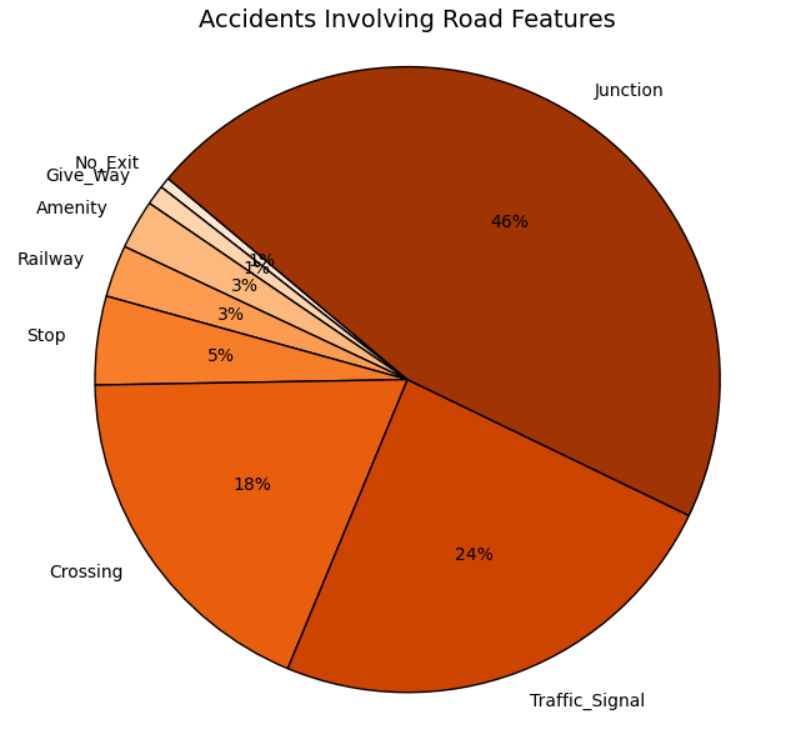

# Task 5- US Accidents Data Analysis  

This project analyzes the **US Accidents Dataset (March 2023)** to uncover patterns in road accidents across cities, times, weather conditions, and road features.  
It uses **Python, Pandas, Seaborn, and Matplotlib** for data processing & visualization.  
---
## Tech Stack & Libraries

- Python 3.8+  
- pandas
- numpy
- matplotlib 
- seaborn
- Jupyter Notebook
---

## Files Used
Dataset used:(https://www.kaggle.com/datasets/sobhanmoosavi/us-accidents)
-Contains information like- timimgs, City, Severity, Weather_Condition, visibility, humidity, road features etc.

---
## Project Overview  

- Loads and processes a **large dataset in chunks** for efficiency  
- Extracts **time-based features** (hour, day)  
- Cleans missing values in key columns like `City`, `Weather_Condition`  
- Analyzes accident patterns by:  
  - **Time of day & day of week**  
  - **Weather & visibility conditions**  
  - **Road features (junctions, crossings, etc.)**  
  - **City-wise distribution**  
- Generates insightful **visualizations**  

---
## Visualizations  
> **Note:** The notebook contains 11 visualizations in total, including bar charts and word clouds for each sentiment category.  
> Below is a sample preview of just one:

- **Road Features Breakdown**  
  


---
## Insights  

### When do accidents happen?  
- **Peak hours:** **7–9 AM** (morning rush) & **3–6 PM** (evening rush)  
- **Lowest accidents:** **2–4 AM**  

### Weather impact  
- Most accidents occur in **Fair/Clear weather** (simply because it’s most common).  
- **Rain, haze, and thunderstorms** cause fewer accidents but can increase severity.  

### Visibility & Severity  
- Most accidents occur with **visibility <10 miles**.  
- Severity levels don’t strongly correlate with visibility.  

### Road features  
- **Junctions (46%)** & **Traffic signals (24%)** are the most accident-prone.  
- Crossings contribute **18%** of accidents.  

### City-wise visibility  
- **Denver** has the **highest visibility (~19 miles)** during accidents.  
- Large metros (LA, Atlanta, Seattle) tend to have **lower visibility (~8–10 miles)**.  

---


## How to Run  

1. **Clone this repo**  
   ```bash
   git clone https://github.com/ship1220/PRODIGY_DS_05.git
   cd your-repo
